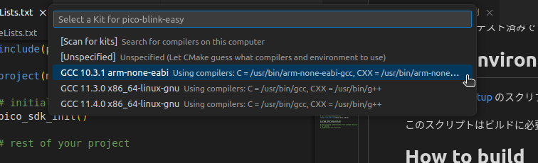

# pico-blink-easy
Pico example which automatically download the SDK. 

# 説明
このプログラムはRaspberryPi Picoのサンプルです。

ビルド中にpico-sdkをダウンロードするため、あらかじめpico-sdkを
設定する必要がありません。

Ubuntu 22.04でテスト済みです。

# ビルド環境の構築
[pico-env-easy](https://github.com/suikan4github/pico-env-easy) のスクリプトを使って環境設定を行ってください。

このスクリプトはビルドに必要なツール類をインストールします。

# Linuxコマンドラインでのビルド
コマンドラインから実行する場合は、以下のコマンドを実行してください。
```bash
# Configure project
mkdir build
cd build
cmake ..

# Build project
cd ..
cmake --build build 
```
この間、Pico-sdkのダウンロードも行うため、少し時間がかかります。

ビルド結果はbuildサブディレクトリに出力されます。

# VS Codeでのビルド(Linux, WSL)

VS Codeを起動したら、メニューバーの File -> Open Folder... でプロジェクトディレクトリを開きます。


## VS Codeの設定
VS Codeの拡張機能に[C/C++ Extention Pack](https://marketplace.visualstudio.com/items?itemName=ms-vscode.cpptools-extension-pack)をインストールしてください。

この拡張機能はC++言語のシンタックス・ハイライティングやIntelli-senseによる入力保管を行う他、CMake拡張機能も含んでいます。
## ビルド
コマンドパレット(ctrl-shift-P)から、
```
Cmake : Configure
```
を実行してください。CMake拡張機能が自動的にコンパイラを探し出してプロジェクトのコンフィギュレーションを行います。この間、Pico-sdkのダウンロードも行うため、少し時間がかかります。

念の為、ステータスバーでコンパイラがGCC XX.X.X arm-none-eabiで有ることを確認してください。下の図の例ではGCC 10.3.1 arm-none-eabiになっています。


arm-none-eabiではない場合には、ステータスバーの当該位置をクリックすることで、メニューバーからプルダウンが現れますので適切なコンパイラを選んでください。



コンパイラを選び終わったら、ステータスバーのBuildをクリックすることでビルドすることができます。

ビルド結果はbuildサブディレクトリに出力されます。

# Windowsコマンドプロンプトでのビルド 

Windowsでビルドする場合、通常のコマンドプロンプトではビルドできません。WindowsのStartメニューから専用のPico - Developper Command Promptを使ってください。

コマンドプロンプトが現れたらプロジェクトディレクトリに移ります。あとは、Linuxのときと同じです。

```cmd
REM Configure project
mkdir build
cd build
cmake .. 

REM Build project
cd ..
cmake --build build 
```
Windowsの場合も、Pico-sdkのダウンロードも行うため、少し時間がかかります。

ビルド結果はbuildサブディレクトリに出力されます。


# VS Codeでのビルド(Windows)

普段使いのVS Codeを起動してもビルドできません。WindowsのStartメニューから専用の Pico - Visual Studio Code を起動してください。

次に、メニューバーの File -> Open Folder... でプロジェクトディレクトリを開きます。

## VS Codeの設定
VS Codeの拡張機能に[C/C++ Extention Pack](https://marketplace.visualstudio.com/items?itemName=ms-vscode.cpptools-extension-pack)をインストールしてください。

この拡張機能はC++言語のシンタックス・ハイライティングやIntelli-senseによる入力保管を行う他、CMake拡張機能も含んでいます。

なお、インストールはローカルではなくWSLに対して行います。
## ビルド
コマンドパレット(ctrl-shift-P)から、
```
Cmake : Configure
```
を実行してください。CMake拡張機能が自動的にコンパイラを探し出してプロジェクトのコンフィギュレーションを行います。この間、Pico-sdkのダウンロードも行うため、少し時間がかかります。

念の為、ステータスバーでコンパイラがGCC XX.X.X arm-none-eabiで有ることを確認してください。下の図の例ではGCC 10.3.1 arm-none-eabiになっています。


arm-none-eabiではない場合には、ステータスバーの当該位置をクリックすることで、メニューバーからプルダウンが現れますので適切なコンパイラを選んでください。


コンパイラを選び終わったら、ステータスバーのBuildをクリックすることでビルドすることができます。

ビルド結果はbuildサブディレクトリに出力されます。

# 各種ペリフェラルを使いたい場合

GPIO以外のペリフェラルを使いたい場合は、以下の作業が必要です。
- APIのインクルード・ファイルを読み込む。
- 対応するライブラリをリンクする。

## APIのインクルードファイルを読み込む
ペリフェラル操作のAPIのインクルードファイルを読み込むためには、[blink.c](blink.c) のしかるべき行のコメントアウトを解除してください。

```C
// Un-comment the desired include line to use the peripheral API.

// #include <hardware/adc.h>
// #include <hardware/claim.h>
// #include <hardware/clocks.h>
// #include <hardware/divider.h>
// #include <hardware/dma.h>
// #include <hardware/flash.h>
// #include <hardware/gpio.h>
// #include <hardware/i2c.h>
// #include <hardware/interp.h>
// #include <hardware/irq.h>
// #include <hardware/pio.h>
// #include <hardware/pll.h>
// #include <hardware/pwm.h>
// #include <hardware/resets.h>
// #include <hardware/rtc.h>
// #include <hardware/spi.h>
// #include <hardware/sync.h>
// #include <hardware/timer.h>
// #include <hardware/uart.h>
// #include <hardware/vreg.h>
// #include <hardware/watchdog.h>
// #include <hardware/xosc.h>
```

## 対応するライブラリをリンクする
ペリフェラル操作用APIのライブラリをリンクするには、CMakeLists.txtのしかるべき行のコメントアウトを解除してください。
```CMake
target_link_libraries(blink pico_stdlib
# Un-comment the desired line to use the peripheral library.

# hardware_adc      # Analog to Digital Converter (ADC) API.
# hardware_claim    # Lightweight hardware resource management.
# hardware_clocks   # Clock Management API.
# hardware_divider  # Low-level hardware-divider access.
# hardware_dma      # DMA  Controller API.
# hardware_flash    # Low level flash programming and erase API.
# hardware_gpio     # General Purpose Input/Output (GPIO) API.
# hardware_i2c      # I2C Controller API.
# hardware_interp   # Hardware Interpolator API.
# hardware_irq      # Hardware interrupt handling.
# hardware_pio      # Programmable I/O (PIO) API.
# hardware_pll      # Phase Locked Loop control APIs.
# hardware_pwm      # Hardware Pulse Width Modulation (PWM) API.
# hardware_resets   # Hardware Reset API.
# hardware_rtc      # Hardware Real Time Clock API.
# hardware_spi      # Hardware SPI API.
# hardware_sync     # Low level hardware spin-lock, barrier and processor event API.
# hardware_timer    # Low-level hardware timer API.
# hardware_uart     # Hardware UART API.
# hardware_vreg     # Voltage Regulation API.
# hardware_watchdog # Hardware Watchdog Timer API.
# hardware_xosc     # Crystal Oscillator (XOSC) API.
)
```

# ライセンス